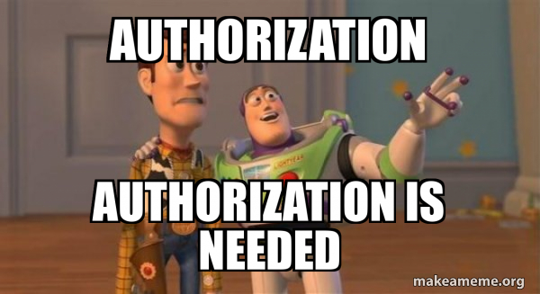

Developed originally by Utagawa Yoshikazu, Early Foreign Photographer in Yokohama; [R-Ladies](https://rladies.org/); [Meetups](https://www.meetup.com/pro/rladies); [R-Ladies Global](https://www.youtube.com/channel/UCDgj5-mFohWZ5irWSFMFcng)

## Original content

- [flexdashboard](https://pkgs.rstudio.com/flexdashboard) 
- [R Markdown](https://rmarkdown.rstudio.com/),
- [{tuber}](https://github.com/soodoku/tuber/#sweet_potato-tuber-access-youtube-api-via-r)
- [YouTube Data API v3](https://developers.google.com/youtube/v3/getting-started)
- [GitHub Actions](https://github.com/features/actions) to automatically refresh the dashboard every 24 hours. Unfortunately, I encountered difficulties due to the authentication options provided by {tuber}, which supports YouTube’s [OAuth 2.0](https://developers.google.com/youtube/v3/guides/authentication) authorization process. I reached out to my [brother](https://github.com/gvelasq) for help since we’d previously collaborated on an [API wrapper](https://github.com/ivelasq/wizehiver) in R. The project [stalled](https://github.com/ivelasq/rladies-video-feed/graphs/contributors) as we tried unsuccessfully to get YouTube’s OAuth 2.0 flow to work with GitHub Actions.

We had a breakthrough when we realized that videos could be accessed relatively painlessly by skipping OAuth 2.0 and using an [API key](https://cloud.google.com/api-keys/docs/overview) instead. After two [pull requests](https://github.com/soodoku/tuber/pulls?q=is%3Apr+author%3Agvelasq) to add API key authentication to {tuber}, we are delighted to announce that the GitHub version of {tuber} now contains functions that work well with GitHub Actions. You can find the finished (and automated!) dashboard here:

](https://ivelasq.github.io/rladies-video-feed)  
https://ivelasq.github.io/rladies-video-feed

The [code](https://github.com/ivelasq/rladies-video-feed) for the dashboard is on GitHub in case you want to reuse it for another set of channels!

YouTube RSS vs. YouTube API

I originally used the [tidyRSS](https://robertmyles.github.io/tidyRSS) package to pull the list of videos from YouTube. However, the YouTube RSS feed limits results to the latest 15 videos. The code is still available in the repo if you would like to take a look. This is a good option if you only want the most recent stream of content and would like to avoid setting up any Google credentials. Thanks to the [R4DS channel](http://r4ds.io/join) and [Tom Mock](https://twitter.com/thomas_mock) for pointing me in the right direction!

The rest of the post describes how we built the dashboard. We learned quite a bit in the process!



## Get a YouTube API key[](#get-a-youtube-api-key)

As is often the case with anything to do with Google, first, you must get credentials. In this example, we were interested in an API key that would work with the YouTube Data API v3.


1.  Log into the [Google Cloud Platform Console](https://console.cloud.google.com/).
2.  Create a [new project](https://console.cloud.google.com/projectcreate).
3.  From your dashboard, click to ‘Go to APIs Overview’ and navigate to ‘[Credentials](https://console.cloud.google.com/apis/credentials)’ in the sidebar.
4.  At the top, click ‘Create Credentials’ and choose ‘API key’.
5.  Your API key will pop up. Save it for reference later in this walkthrough.
6.  In the pop-up window (or in the hamburger menu for the API key), click ‘Edit API key’.
7.  Scroll to the bottom and under ‘API restrictions’, select ‘Restrict key’, select ‘YouTube Data API v3’ from the dropdown menu, click ‘OK’ to exit the dropdown menu, then click ‘Save’. This will restrict your API key so that it can only be used with the YouTube Data API v3, which will limit its usefulness should anyone get ahold of your key.

## Store your YouTube API key[](#store-your-youtube-api-key)

Now that you have an API key, you will want to save it in your R environment (`.Renviron`) using [`usethis::edit_r_environ()`](https://usethis.r-lib.org/reference/edit.html) if working interactively or in your [repository secrets](https://docs.github.com/en/actions/security-guides/encrypted-secrets) if using GitHub Actions. Storing the API key as an environment variable allows you to access it easily without the need to manually input it every time you run your code. GitHub Actions can interact with the API without manual intervention, and storing it as a repository secret keeps the key separate from your source code so it is not exposed to others.

To do this, follow the instructions below:

1.  Install the CRAN version of [{httr2}](https://httr2.r-lib.org/) and the GitHub version of [{tuber}](https://github.com/soodoku/tuber/blob/master/NEWS.md). [{pak}](https://pak.r-lib.org/) allows for easy installation of packages, whether they are on CRAN, GitHub, pull requests, etc.

```
<a id="cb1-1"></a># install.packages("pak")      # Install {pak} if not yet installed
<a id="cb1-2"></a>pak::pak(httr2, soodoku/tuber) # CRAN and GitHub syntax side by side!
```

2.  On your local machine, save your YouTube API key in `.Renviron`. Running the code below will prompt you to save the API key. Paste your API key into the pop-up window:

Now your YouTube API key is saved as `YOUTUBE_KEY` in `.Renviron`!

Using an API key is considered [relatively insecure](https://httr2.r-lib.org/articles/wrapping-apis.html#security-considerations) since the key itself will be included in queries sent over the Internet and thus could be intercepted. If you are considering including an API key in a package or in public source code, we recommend using the [secret management](https://httr2.r-lib.org/articles/wrapping-apis.html#secret-management) functions provided by {httr2}.

If you would like to encrypt your API key, you can do so using {httr2} and a few arguments we built into {tuber}. You can first create a {tuber} package key stored as `TUBER_KEY` with `tuber::yt_set_key(httr2::secret_make_key(), type = "package")` and an encrypted `YOUTUBE_KEY` with `tuber::yt_set_key(httr2::secret_encrypt("YOUR_UNENCRYPTED_API_KEY", key = "TUBER_KEY"))`. To retrieve a decrypted `YOUTUBE_KEY` in your code, you can then run `tuber::yt_get_key(decrypt = TRUE)`.

Please note that encrypting your API key will keep it safe if others don’t have your `TUBER_KEY` to decrypt it, but it will still need to be included unencrypted in queries to interact with the YouTube Data API.

## Pull and clean data[](#pull-and-clean-data)

Woohoo, you are credentialed! It’s time for the fun part — pulling and cleaning data. I did this in a script called [`data_processing.R`](https://github.com/ivelasq/rladies-video-feed/blob/main/data-processing.R).

In addition to {tuber}, here are other packages that will aid you in the cleaning process:

```
<a id="cb3-1"></a>library(tuber) # GitHub version, installed with pak::pak(soodoku/tuber)
<a id="cb3-2"></a>library(readr)
<a id="cb3-3"></a>library(dplyr)
<a id="cb3-4"></a>library(stringr)
<a id="cb3-5"></a>library(DT)
```

Create a spreadsheet with the channels you are interested in. I created this manually — I just searched on YouTube for all the R-Ladies channels I could find. To make this workflow as programmatic as possible, I only included the chapter name, thumbnail, and channel ID.

```
<a id="cb4-1"></a>dat <-
  <a id="cb4-2"></a>read_csv("https://github.com/ivelasq/rladies-video-feed/blob/main/r-ladies_channels.csv")
  

<a id="cb4-4"></a>head(dat)
```

```
  chapter            image                                              id   
  <chr>              <chr>                                              <chr>
1 R-Ladies Global    https://yt3.ggpht.com/ytc/AKedOLRM4FPiPcPBdFUmYWR… UCDg…
2 R-Ladies Baltimore https://yt3.ggpht.com/RQifC3qp_7AFeTc48-QV1i4WBNM… UC9U…
3 R-Ladies Philly    https://yt3.ggpht.com/ytc/AKedOLShIKBvPUKqbvm_Cpu… UCPq…
4 R-Ladies STL       https://yt3.ggpht.com/ytc/AKedOLSBA7rlz1yvbIJ7TVN… UCQ7…
5 R-Ladies Sydney    https://yt3.ggpht.com/ytc/AKedOLQnaU-dJbb14j2RE6W… UCkr…
6 R-Ladies Vancouver https://yt3.ggpht.com/3yf0Zo8-VKffrG-dRT_Gs85xX_x… UCX5…
```

Some YouTube channels have ‘custom IDs’ like RLadiesGlobal. These won’t work in {tuber}; you need the original IDs. The best way I found to get this ID is to click on a video from a channel. Then, scroll down to the description and click the channel name from that video. The original ID will appear in the URL after `/channel/`. A good idea for a future Shiny app would be a way to pull this information from the YouTube API…

Now, create a few more columns with `dplyr::mutate()` that expand the URLs into HTML format:

```
<a id="cb6-1"></a>dat_urls <-
  <a id="cb6-2"></a>dat %>%
  <a id="cb6-3"></a>dplyr::mutate(
    <a id="cb6-4"></a>feed = paste0("https://www.youtube.com/feeds/videos.xml?channel_id=", id),
    <a id="cb6-5"></a>feed_url = paste0("yt:channel:", id),
    <a id="cb6-6"></a>channel_image_url = paste0(
      <a id="cb6-7"></a>"</a>image,
      <a id="cb6-9"></a>"' alt='Hex Sticker for Chapter' width='40'></img>",
      <a id="cb6-10"></a>" <a href='https://www.youtube.com/channel/",
      <a id="cb6-11"></a>id,
      <a id="cb6-12"></a>"' target='_blank'>",
      <a id="cb6-13"></a>chapter,
      <a id="cb6-14"></a>"</a><br>"
    <a id="cb6-15"></a>),
  <a id="cb6-16"></a>)
```

The {tuber} [documentation](https://soodoku.github.io/tuber/reference/) describes the many functions available to you. Many of these require OAuth 2.0 authentication. Since I had only the channel IDs, I wanted to use `list_channel_videos()` to get a complete list of videos from the channels, which thankfully works with an API key!

For example, for the R-Ladies Global channel, you could run `list_channel_videos()` to get its (currently 165) videos:

```
<a id="cb7-1"></a>tuber::list_channel_videos("UCDgj5-mFohWZ5irWSFMFcng", max_results = 200, auth = "key")
```

What if you want the results for all the channels we have in our spreadsheet? I used a loop for this.

```
1<a id="annotated-cell-8-1"></a>dat_videos <- NULL

2<a id="annotated-cell-8-3"></a>for (i in 1:nrow(dat_urls)) {
  <a id="annotated-cell-8-4"></a>tmp <-
3    <a id="annotated-cell-8-5"></a>dat_urls[i, ]["id"] %>%
4    <a id="annotated-cell-8-6"></a>dplyr::pull() %>%
5    <a id="annotated-cell-8-7"></a>tuber::list_channel_videos(
      <a id="annotated-cell-8-8"></a>.,
      <a id="annotated-cell-8-9"></a>part = "snippet",
      <a id="annotated-cell-8-10"></a>config = list('maxResults' = 200),
      <a id="annotated-cell-8-11"></a>auth = "key"
    <a id="annotated-cell-8-12"></a>)
6  <a id="annotated-cell-8-13"></a>dat_videos <- dplyr::bind_rows(dat_videos, tmp)
<a id="annotated-cell-8-14"></a>}
```

1

Starting with an empty data frame called `dat_videos`,

2

For each row in `dat_urls` (which contains the channel IDs),

3

Find the channel ID,

4

Pull the expanded URL,

5

Run it through `list_channel_videos()`, and

6

Add the information as rows to `dat_videos`.

The arguments in `list_channel_videos()` gave me all the columns I am interested in with `part = "snippet"`. Notice that there’s a default limit for the number of videos pulled from the API. I bumped that up a bit with the `maxResults` argument.

Then, I brought back the URL info:

```
<a id="cb8-1"></a>dat_join <-
  <a id="cb8-2"></a>dat_videos %>%
  <a id="cb8-3"></a>dplyr::left_join(., dat_urls, by = join_by("snippet.channelId" == "id"))
```

This results in a **lot** of information for each video. I cleaned it up a bit so that the data frame contained only the relevant columns in HTML format.

```
<a id="cb9-1"></a>dat_dashboard <-
  <a id="cb9-2"></a>dat_join %>%
  <a id="cb9-3"></a>dplyr::mutate(
    <a id="cb9-4"></a>video_url = paste0(
      <a id="cb9-5"></a>"<a href='https://www.youtube.com/watch?v=",
      <a id="cb9-6"></a>snippet.resourceId.videoId,
      <a id="cb9-7"></a>"' target='_blank'>",
      <a id="cb9-8"></a>snippet.title,
      <a id="cb9-9"></a>"</a>"
    <a id="cb9-10"></a>),
    <a id="cb9-11"></a>channel_url = paste0(
      <a id="cb9-12"></a>"</a>image,
      <a id="cb9-14"></a>"' alt='Hex Sticker for Chapter' width='40'></img>",
      <a id="cb9-15"></a>"<a href='https://www.youtube.com/channel/",
      <a id="cb9-16"></a>snippet.channelId,
      <a id="cb9-17"></a>"' target='_blank'>",
      <a id="cb9-18"></a>chapter,
      <a id="cb9-19"></a>"</a>"
    <a id="cb9-20"></a>),
    <a id="cb9-21"></a>date = as.Date(str_sub(snippet.publishedAt, 1, 10))
  <a id="cb9-22"></a>) %>%
  <a id="cb9-23"></a>dplyr::arrange(desc(snippet.publishedAt)) %>%
  <a id="cb9-24"></a>dplyr::select(date, chapter, channel_url, video_url, channel_image_url)
```

See the [final data processing file on GitHub](https://github.com/ivelasq/rladies-video-feed/blob/main/data-processing.R).

You have the YouTube data — time to create a pretty dashboard!

My flexdashboard started as R Markdown files often do: with a YAML header. I specified an orientation (columns) and added the link to the GitHub repository in the navigation bar.

```
<a id="cb10-1"></a>---
<a id="cb10-2"></a>title: 

"R-Ladies YouTube Video Feed"
<a id="cb10-3"></a>output: 
  <a id="cb10-4"></a>flexdashboard::flex_dashboard:
    <a id="cb10-5"></a>orientation: columns
    <a id="cb10-6"></a>navbar:
      <a id="cb10-7"></a>- 

{ 

icon: 

"fa-github", 

href: 

"https://github.com/ivelasq/rladies-video-feed", 

align: right }
<a id="cb10-8"></a>---
```

### Add customization[](#add-customization)

If you’d like your dashboard to have a custom look, the [{bslib}](https://rstudio.github.io/bslib) package is a great option. It can add different colors and fonts directly in the YAML header. Make sure to add `library(bslib)` in the actual code part of your `.Rmd` file. I used the R-Ladies style guide to fill out the rest of the YAML header:

```
<a id="cb11-1"></a>---
<a id="cb11-2"></a>title: 

"R-Ladies YouTube Video Feed"
<a id="cb11-3"></a>output: 
  <a id="cb11-4"></a>flexdashboard::flex_dashboard:
    <a id="cb11-5"></a>orientation: columns
    <a id="cb11-6"></a>navbar:
      <a id="cb11-7"></a>- 

{ 

icon: 

"fa-github", 

href: 

"https://github.com/ivelasq/rladies-video-feed", 

align: right }
    <a id="cb11-8"></a>theme:
      <a id="cb11-9"></a>version: 

4
      <a id="cb11-10"></a>bg: 

"#FDF7F7"
      <a id="cb11-11"></a>fg: 

"#88398A" # purple
      <a id="cb11-12"></a>primary: 

"#88398A" # purple
      <a id="cb11-13"></a>base_font:
        <a id="cb11-14"></a>google: 

"Lato"
<a id="cb11-15"></a>---
```

### Add packages for the dashboard[](#add-packages-for-the-dashboard)

Below the YAML header, add the packages you need. I used `source()` to read the `data-processing.R` script.

```
<a id="cb12-1"></a>library(flexdashboard)
<a id="cb12-2"></a>library(bslib)
<a id="cb12-3"></a>source("data-processing.R", local = knitr::knit_global())
```

## Design the flexdashboard layout[](#design-the-flexdashboard-layout)

This dashboard has a simple layout: just a sidebar and the main section. I recommend checking out the flexdashboard documentation to see all the [layout options](https://pkgs.rstudio.com/flexdashboard/articles/layouts.html) available to you.

This code builds out the sidebar section. I created a list of each R-Ladies chapter that I was able to find and arranged them by name. With `htmltools::HTML()`, the dashboard can render the URLs as HTML (the reason for all that manipulation earlier on). We learned that the `.noWS = "outside"` argument is crucial for deploying the dashboard with GitHub Actions. It omits extra whitespace around the HTML, which ensures that the dashboard is committed only when the number of videos has changed (rather than creating spurious commits each time data is pulled, even if the number of videos is unchanged).

```
<a id="cb13-1"></a>Channels {.sidebar}
<a id="cb13-2"></a>-----------------------------------------------------------------------

<a id="cb13-4"></a>The purpose of this dashboard is to provide a running feed of R-Ladies videos posted to YouTube. It is refreshed every 24 hours.

<a id="cb13-6"></a>Currently, the feed includes these channels:

<a id="cb13-8"></a>```{r}
<a id="cb13-9"></a>dat_join %>% 
  <a id="cb13-10"></a>dplyr::arrange(chapter) %>% 
  <a id="cb13-11"></a>dplyr::distinct(channel_image_url) %>% 
  <a id="cb13-12"></a>dplyr::pull() %>% 
  <a id="cb13-13"></a>htmltools::HTML(.noWS = "outside")
<a id="cb13-14"></a>```
```

For the main body, I used [{DT}](https://rstudio.github.io/DT) to create a table for the information in our clean dataset.

```
<a id="cb14-1"></a>Column {data-width=900}
<a id="cb14-2"></a>-----------------------------------------------------------------------

<a id="cb14-4"></a>### By default, the list is sorted by latest video.

<a id="cb14-6"></a><style>
<a id="cb14-7"></a>.dataTables_scrollBody {
    <a id="cb14-8"></a>max-height: 100% !important;
<a id="cb14-9"></a>}
<a id="cb14-10"></a></style>

<a id="cb14-12"></a>```{r}
<a id="cb14-13"></a>dat_dashboard %>%
  <a id="cb14-14"></a>dplyr::select(-chapter, -channel_image_url) %>%
  <a id="cb14-15"></a>DT::datatable(
    <a id="cb14-16"></a>colnames = c("Date", "Channel", "Video"),
    <a id="cb14-17"></a>filter = "top",
    <a id="cb14-18"></a>escape = FALSE, # <1>
    <a id="cb14-19"></a>height = "1000", # <2>
    <a id="cb14-20"></a>elementId = "dashboard",
    <a id="cb14-21"></a>options = list(columnDefs = list( # <3>
      <a id="cb14-22"></a>list(className = "dt-middle", targets = "_all")
    <a id="cb14-23"></a>))
  <a id="cb14-24"></a>)
<a id="cb14-25"></a>```
```

1.  `escape = FALSE` renders the URLs within the table as HTML.
2.  `height = "1000"` makes it expand to the entire column height.
3.  The list within `options` aligns the text within columns (in this case, to be in the middle of the cell for all columns).<a id="fnref1"></a>[<sup>1</sup>](https://ivelasq.rbind.io/blog/automated-youtube-dashboard/#fn1)

And that’s it! See the [final dashboard code](https://github.com/ivelasq/rladies-video-feed/blob/main/index.Rmd) on GitHub.


Final dashboard

[Try it out](https://ivelasq.github.io/rladies-video-feed/) — search “Shiny” to see any video with Shiny in the title, or “Ecuador” to see all the videos from R-Ladies Ecuador!

## Create a GitHub Action workflow[](#create-a-github-action-workflow)

Great, we have a completed dashboard! Now, what if we want to keep it updated without manually re-knitting the dashboard? The next step is to create a GitHub Action. GitHub Actions are workflows that you create and configure to automate various tasks within your GitHub repositories. They are event-driven and can be triggered by actions such as code commits, pull requests, issue updates, or scheduled intervals.

### Create a GitHub Action workflow file in your project[](#create-a-github-action-workflow-file-in-your-project)

GitHub Actions use [YAML syntax](https://yaml.org/) and are saved as `.yml` or `.yaml` files within a folder called `.github/workflows/`. We can use GitHub Actions to create a bot that refreshes the dashboard on a regular basis. You can see an [example workflow in the GitHub repository](https://github.com/ivelasq/rladies-video-feed/blob/main/.github/workflows/rladies-videos-bot.yaml). H/T to [@gvelasq](https://github.com/gvelasq) and this amazing [example](https://github.com/r-lib/actions/blob/v2/examples/render-rmarkdown.yaml) in the [r-lib/actions](https://github.com/r-lib/actions/tree/v2/examples#readme) repo for inspiration.

To create a GitHub Action:

1.  Create a folder in your repository called `.github`.
2.  Within `.github`, add a folder called `workflows`.
3.  Create a file called `rladies-videos-bot.yaml`.
4.  Copy and paste the workflow below in `rladies-videos-bot.yaml`.

```
<a id="annotated-cell-16-1"></a>on:
  <a id="annotated-cell-16-2"></a>schedule:
1    <a id="annotated-cell-16-3"></a>- 

cron: 

'0 0 * * *'

<a id="annotated-cell-16-5"></a>name: rladies-videos-bot

<a id="annotated-cell-16-7"></a>jobs:
  <a id="annotated-cell-16-8"></a>rladies-videos-bot:
    <a id="annotated-cell-16-9"></a>runs-on: ubuntu-latest
    <a id="annotated-cell-16-10"></a>env:
      <a id="annotated-cell-16-11"></a>GITHUB_PAT: ${{ secrets.GITHUB_TOKEN }}
      <a id="annotated-cell-16-12"></a>YOUTUBE_KEY: ${{ secrets.YOUTUBE_KEY }}
    <a id="annotated-cell-16-13"></a>steps:
      <a id="annotated-cell-16-14"></a>- 

uses: actions/checkout@v3
        <a id="annotated-cell-16-15"></a>with:
          <a id="annotated-cell-16-16"></a>fetch-depth: 

0
      <a id="annotated-cell-16-17"></a>- 

uses: r-lib/actions/setup-pandoc@v2
      <a id="annotated-cell-16-18"></a>- 

uses: r-lib/actions/setup-r@v2
        <a id="annotated-cell-16-19"></a>with:
          <a id="annotated-cell-16-20"></a>use-public-rspm: 

true
2      <a id="annotated-cell-16-21"></a>- 

uses: r-lib/actions/setup-r-dependencies@v2
        <a id="annotated-cell-16-22"></a>with:
3          <a id="annotated-cell-16-23"></a>extra-packages: soodoku/tuber
      <a id="annotated-cell-16-24"></a>- 

name: Render and commit dashboard
        <a id="annotated-cell-16-25"></a>run: |
          <a id="annotated-cell-16-26"></a>Rscript -e 'rmarkdown::render("index.Rmd")'
          <a id="annotated-cell-16-27"></a>git config --local user.name "$GITHUB_ACTOR"
          <a id="annotated-cell-16-28"></a>git config --local user.email "$GITHUB_ACTOR@users.noreply.github.com"
          <a id="annotated-cell-16-29"></a>git add index.html
          <a id="annotated-cell-16-30"></a>git commit -m '[Bot] Render and commit dashboard' || echo "No changes to commit"
          <a id="annotated-cell-16-31"></a>git push origin || echo "No changes to commit"
```

1

The workflow uses [cron](https://en.wikipedia.org/wiki/Cron) syntax to trigger the workflow to start at midnight every day, running through all the tasks detailed in the workflow: pulling the secret keys, setting up R and required packages, rendering `index.Rmd`, and committing the resulting `index.html` file only if there are any changes to commit. Matt Dray’s [{dialga}](https://github.com/matt-dray/dialga) package is helpful in building cron expressions.

2

The GitHub Action [`r-lib/actions/setup-r-dependencies@v2`](https://github.com/r-lib/actions/tree/v2-branch/setup-r-dependencies#setup-r-dependencies) installs R packages that are declared in a `DESCRIPTION` file. In our case, since our RStudio project name is not a valid R package name due to the hyphens in `rladies-video-feed`, we created a `DESCRIPTION` file using `usethis::use_description(check_name = FALSE)` and added the dependencies to `Imports:` below using `usethis::use_package()` for each required R package.

3

To get `r-lib/actions/setup-r-dependencies@v2` to install the GitHub version of {tuber}, we specified it using the `extra-packages` parameter.

The `Imports:` section of our [`DESCRIPTION`](https://github.com/ivelasq/rladies-video-feed/blob/main/DESCRIPTION) file looks like this:

```
<a id="cb15-1"></a>Imports: 
    <a id="cb15-2"></a>bslib,
    <a id="cb15-3"></a>dplyr,
    <a id="cb15-4"></a>DT,
    <a id="cb15-5"></a>flexdashboard,
    <a id="cb15-6"></a>htmltools,
    <a id="cb15-7"></a>httr2,
    <a id="cb15-8"></a>jsonlite,
    <a id="cb15-9"></a>readr,
    <a id="cb15-10"></a>rmarkdown,
    <a id="cb15-11"></a>stringr
```

### Configure keys on GitHub[](#configure-keys-on-github)

Now that we have the workflow set up, we need to let GitHub know what our YouTube API key is so that it can be accessed each time the workflow is triggered.

1.  In your GitHub repository, click the ‘Settings’ tab.
2.  Under ‘Security’ on the left-hand side, click ‘Secrets and variables’ then ‘Actions’.
3.  Click the ‘Secrets’ tab, then click ‘New repository secret’.
4.  Give your new secret the name `YOUTUBE_KEY` and in the ‘Secret’ textbox, paste your YouTube API key, then select ‘Add secret’.

Now your GitHub repository is configured to run the workflow script. Your GitHub Action is ready to go!

## Host the dashboard[](#host-the-dashboard)

To host the dashboard, I used GitHub Pages. In the GitHub repository for your dashboard, go to ‘Settings’, then ‘Pages’. Choose the branch and folder of your flexdashboard `index.html` output file, click ‘Save’, and then you will have a URL to showcase your work.

Here is the final link for this dashboard: https://ivelasq.github.io/rladies-video-feed.

## Summary[](#summary)

In summary, we have explored the powerful combination of {flexdashboard}, GitHub Actions (via `r-lib/actions`), and {tuber} to create an automated YouTube dashboard.

- With {flexdashboard}’s customizability and R Markdown support, we can create a visually appealing, interactive dashboard.
- The {tuber} package’s integration with the YouTube Data API and new functions we contributed to permit YouTube API key authentication allow us to easily fetch data and keep track of YouTube videos.
- With the automation capabilities of GitHub Actions, we can schedule dashboard updates and stay up-to-date with new YouTube videos.

It took a while, but we got there! Many thanks to [@gvelasq](https://github.com/gvelasq)’s support in getting this through the finish line.

Give this tutorial a try and unlock the potential of automated dashboards for your favorite YouTube channels! I’d love to see what you create!

### Coda[](#coda)

If you made it all the way to the end of this tutorial, I need to plug (as an employee of Posit, formerly RStudio 😁): [Posit Connect](https://posit.co/products/enterprise/connect/)! Posit Connect is a platform that allows you to publish and share data products like Quarto docs, Shiny apps, and – you guessed it – dashboards made with {flexdashboard}!

Automating reports and dashboards is easy on Posit Connect. The scheduler is built into the interface and can be adjusted to your specifications. *Never write another Cron job again*.


Since this is a pet project, I opted not to use Posit Connect, but it certainly was tempting…😇

*Liked this article? I’d love for you to share!*

- <a id="tabset-1-1-tab"></a>Twitter
- <a id="tabset-1-2-tab"></a>Mastodon

1.  I found out about this here: https://stackoverflow.com/questions/35749389/column-alignment-in-dt-datatable.[↩︎](https://ivelasq.rbind.io/blog/automated-youtube-dashboard/#fnref1)